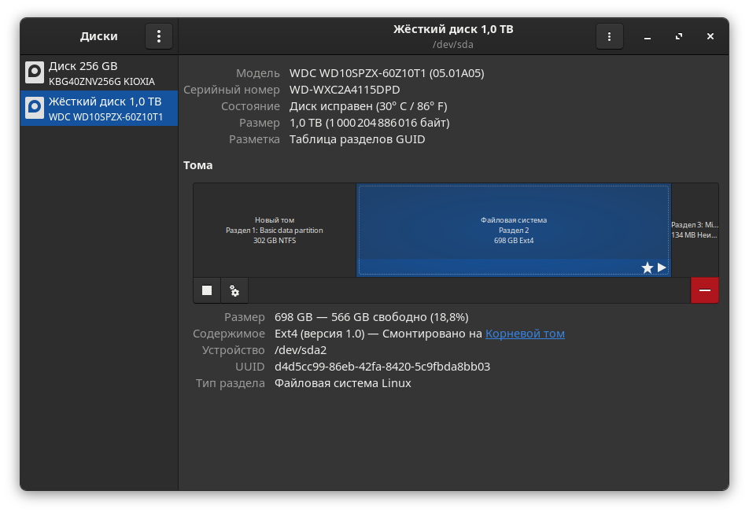
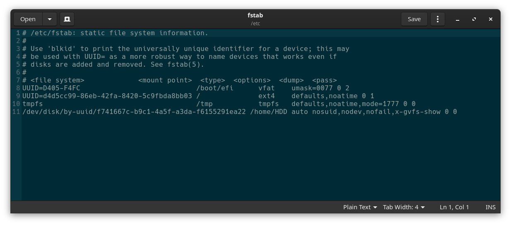
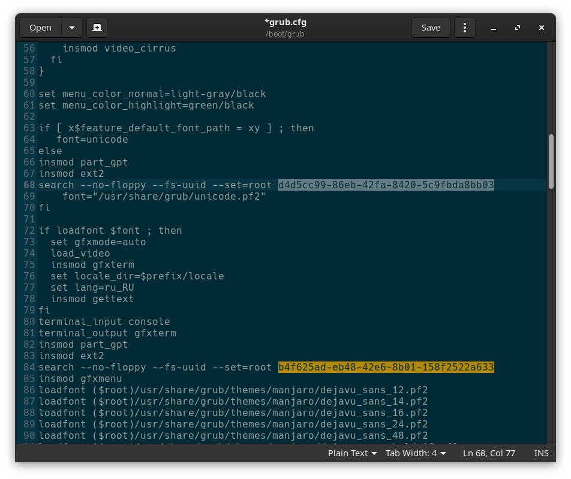

# Как перенести корневую папку Linux на другой диск

Поскольку все данные, настройки и объекты операционной системы Linux - это файлы, то вы можете перенести свою операционную систему куда нужно, просто скопировав все нужные файлы. В Windows так же просто не получится, так, как там более сложная файловая система со сложными зависимостями.

## 1. Подготовка к переносу
Сначала создайте LiveCD диск и загрузитесь с него, тогда точно все нужные данные будут сохранены.  
В папку **/mnt/source** примонтируйте раздел, на котором будет располагаться новая корневая папка Linux. Например, это **/dev/nvme0n1p4**:
```bash
$ sudo mount /dev/nvme0n1p4 /mnt/source
```
В папку **/mnt/destination** примонтируйте раздел, на котором будет располагаться новая корневая папка Linux. Например, это **/dev/sda2**:
```bash
$ sudo mount /dev/sdb2 /mnt/destination
```
## 2. Перенос утилитой cp
Теперь нужно рекурсивно скопировать все файлы из **/mnt/source** в **/mnt/destination**. Запустите сам перенос Linux на другой диск. Для этого запустите утилиту cp с опциями  **-r**, **-x** и **-a**. 
- **-r** рекурсивный обход файловой системы
- **-x** ограничивает рекурсию только текущей файловой системой
- **-a** включает сохранение исходных прав и метаданных файла

Точка в конце пути источника предотвратит создание в корне приёмника копии папки **source**. Это особенность команды **cp**.
```bash
$ sudo cp -rxa /mnt/source/. /mnt/destination
```
## 3. Правка fstab
Далее будем работать только с новой системой. Первым делом нужно исправить файл **/etc/fstab**, чтобы там был указан правильный UUID корневого раздела. Узнать UUID нужного раздела можно при помощи утилиты **gnome-disks**:
```bash
$ gnome-disks
```

Замените полученным UUID, значение этого параметра корневого раздела в **/mnt/destination/etc/fstab**:
```bash
$ sudo gedit /mnt/destination/etc/fstab
```

## 4. Правка grub.cfg
Исправьте файл **/boot/grub/grub.cfg**, чтобы там был указан правильный UUID корневого раздела. Как узнать UUID указано выше (пункт 3). Замените полученным UUID, значение этого параметра корневого раздела в **/mnt/destination/boot/grub/grub.cfg** (порядка 14 замен требуется):
```bash
$ sudo gedit /mnt/destination/boot/grub/grub.cfg
```

Далее переходим к пункту 6, если нужно изменить только корневой каталог.
## 5. Полное колонирование системы
Для полного клонирования необходимо:

Определить ваш EFI-раздел и узнайть его параметры указано выше (пункт 2). Смонтировать EFI-раздел **/dev/nvme0n1p1** в каталог **/mnt/destination/boot/efi**.
```bash
$ sudo mount /dev/nvme0n1p1 /mnt/destination/boot/efi
```
Теперь ваш EFI-раздел должен быть смонтирован и доступен по пути **/mnt/destination/boot/efi**, и вы можете продолжить установку GRUB.

Смонтировать каталог **/dev** (где находятся устройства, доступные в системе) в каталог **/mnt/destination/dev**. Это необходимо, чтобы обеспечить доступ к устройствам в среде.
```bash
$ sudo mount --bind /dev /mnt/destination/dev
```
Смонтировать виртуальную файловую систему **/proc**, которая содержит информацию о процессах и системе, в каталог **/mnt/destination/proc**.
```bash
$ sudo mount --bind /proc /mnt/destination/proc
```
Смонтировать виртуальную файловую систему **/sys**, которая содержит информацию о устройствах и драйверах, в каталог **/mnt/destination/sys**.
```bash
$ sudo mount --bind /sys /mnt/destination/sys
```
Изменить корневую файловую систему на **/mnt/destination**. После выполнения этой команды все последующие команды будут выполняться в контексте новой корневой файловой системы, которая находится в **/mnt/destination**
```bash
$ sudo chroot /mnt/destination
```
Теперь установите загрузчик grub на новый диск. Как узнать его параметры указано выше (пункт 2). Замените полученным названием устройства, значение этого параметра.
- **--target=x86_64-efi** указывает, что целевая платформа для установки — это 64-битная система с поддержкой UEFI.
- **--efi-directory=/boot/efi** указывает путь к каталогу, где находится EFI-раздел. Этот раздел используется для хранения загрузчиков и других файлов, необходимых для загрузки системы в режиме UEFI.
- **--boot-directory=/boot** указывает путь к каталогу, где будут храниться файлы загрузчика GRUB.
- **/dev/sda** указывает, на какой диск будет установлен загрузчик. 
```bash
$ sudo grub-install --target=x86_64-efi --efi-directory=/boot/efi --boot-directory=/boot /dev/sda
```
Grub должен корректно установиться и можно выходить из корневой файловой системы.
```bash
exit
```
## 6. Перезагрузка
Перезагрузите компьютер. В BIOS вашего компьютера выберите диск, с которого вы обычно загружались, в качестве первого источника для загрузки (верните настройки BIOS в изначальное состояние). После загрузки вы будете уже в новом корневом каталоге и всегда сможете вернуться.
## Выводы
В этой статье мы разобрали, как перенести корневую папку Linux на другой диск с помощью утилиты cp. Как видите, это достаточно просто и быстро.
